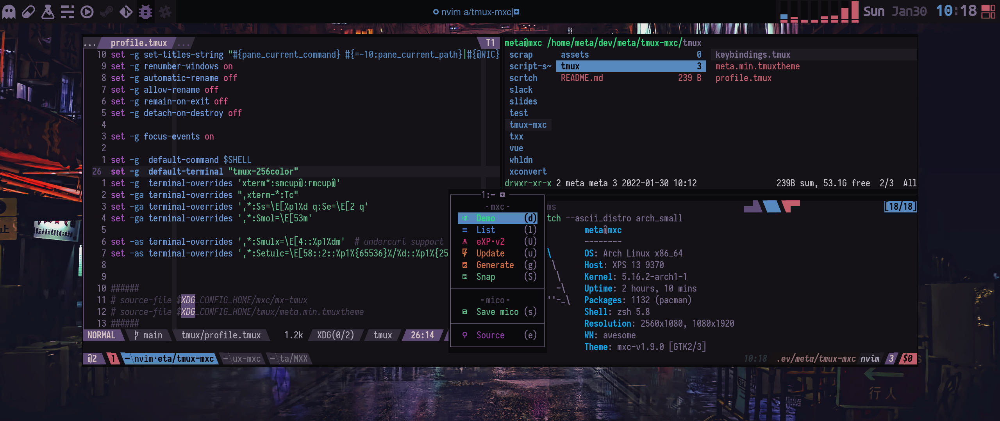

# tmux-mxc
<p align="center">
  
</p>

dark tmux theme, with random colors from mxcolr project

<p align="center">
  
</p>

Usage
=====
```
cp ./tmux ~/.config/tmux -r
```

```
tmux -f ~/.config/tmux/.tmux.conf new-session\; attach \; source-file ~/.config/tmux/meta.min.tmuxtheme
```
## The theme file `tmux.mx` is generated by [mxcolr](https://github.com/metaory/mxcolr)

TODO: write readme
