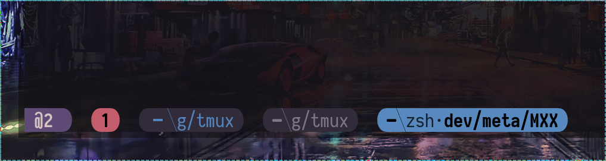

XTMUX
=====

<div align=center>
  
  
  
</div>


<p align="center">
  
</p>

<p align="center">
  
</p>

---

ENVIRONMENT
===========

Defaults:
```sh
export TMUX_WIN_ICO="⛛ "
export TMUX_SES_ICO="✱ "
```

<details>
  <summary>
    <h2> Older </h2>
  </summary>

  <p align="center">
    
  </p>

  <p align="center">
    
  </p>

  <p align="center">
    
  </p>

  <p align="center">
    
  </p>
</details>
<p align="center">
  
</p>

---

> [!Caution]
> Make sure
>
> - Backup `~/.config/tmux`
> - Remove if `~/.tmux.conf` exist
> - Remove if other related exist


# Installation

- CLONE
- LINK


```ex
# Clone the repo
git clone --recursive git@github.com:metaory/xtmux.git

# Link it
ln -svf $PWD/xtmux/tmux ~/.config/tmux

# new tmux session with no arguments should work!
tmux

# install plugins on first run (optional)
# > Press prefix + I (capital i, as in Install) to fetch the plugin.
# eg. C-s + I

```
> [!Important]
> the theme file is from
>
> - [colors.tmux](tmux/colors.tmux) template [confsubst](https://github.com/metaory/confsubst/blob/master/templates/colors.tmux)

---

## License

[MIT](LICENSE)
